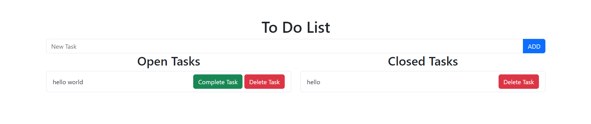

# To-Do List App

This web application is a simple To-Do List where you can add, complete, and delete tasks. It is built using PHP with a MySQL database.

## Features
- Add tasks
- Mark open tasks as completed
- Delete open or completed tasks
- Display open and closed tasks separately

## Prerequisites

Before starting, make sure you have the following:
- [XAMPP](https://www.apachefriends.org/index.html) or a local server with PHP and MySQL
- A web browser
- A text editor (e.g., VS Code, Sublime Text)

## Installation

### 1. Clone the project
```bash
    git clone https://github.com/your-username/todolist-app.git
    cd todolist-app
 ```
    

### 2. Create the database
Connect to your MySQL server using phpMyAdmin or another tool, and run the following SQL queries to create the database and the tasks table:
CREATE DATABASE todolist;
USE todolist;
```
CREATE TABLE tasks (
    id INT(11) AUTO_INCREMENT PRIMARY KEY,
    task_name VARCHAR(256) NOT NULL,
    closed_tasks TINYINT(4) DEFAULT 0,
    created_at DATE
);
```
### 3. Configure the database connection
**In the db.php file, make sure to set the correct database connection details:**
```
<?php
$servername = "localhost";
$username = "root";  // Your MySQL username
$password = "";      // Your MySQL password
$dbname = "todolist"; // Your database name

// Create connection
$conn = new mysqli($servername, $username, $password, $dbname);

// Check connection
if ($conn->connect_error) {
    die("Connection failed: " . $conn->connect_error);
}
?>
```
### 4. Run the application

Start Apache and MySQL from XAMPP.
Open a browser and go to http://localhost/todolist-app/.

### 5. Usage

- Add a task: Enter a new task in the text field and click the ADD button.
- Complete a task: Click the Complete Task button to mark a task as completed.
- Delete a task: Click the Delete Task button to permanently delete a task.

### Screenshot



### Credits
- This app uses Bootstrap 5 for a simple and responsive design.

### Contact

Feel free to reach out if you have any suggestions or improvements:

- **Name**: Adam Bour
- **Email**: [bouradam.adam@gmail.com](mailto:bouradam.adam@gmail.com)
- **LinkedIn**: [Adam Bour](https://linkedin.com/in/adam-bour-9a5020277)
